# 🎨 Video Orchestrator - UML Diagrams

## 1. Component Diagram (High-Level Architecture)

---

## 2. Class Diagram (Service Layer)

---

## 3. Sequence Diagram (Auto-Pilot Video Creation)

---

## 4. Activity Diagram (Video Export Workflow)

---

## 5. State Diagram (Job Status)

```plantuml
@startuml Job Status State Machine

[*] --> Pending : Job created

Pending --> Running : Start processing

Running --> Running : Progress update\n(0% → 100%)

Running --> Complete : All steps successful
Running --> Failed : Error occurred

Complete --> [*]
Failed --> [*]

note right of Running
  Steps:
  1. Script (10%)
  2. Analysis (20%)
  3. Assets (35%)
  4. Voice-over (50%)
  5. Audio (65%)
  6. Subtitles (80%)
  7. Export (100%)
end note

@enduml
```

---

## 6. Deployment Diagram

---

## 7. Package Diagram (Monorepo Structure)

---

## 8. Entity Relationship Diagram (File-Based Storage)

---

## How to View UML Diagrams

### Option 1: PlantUML Online
1. Visit: https://www.plantuml.com/plantuml/uml/
2. Copy diagram code
3. Paste and view

### Option 2: VS Code Extension
1. Install "PlantUML" extension
2. Open this file
3. Press `Alt+D` to preview

### Option 3: IntelliJ IDEA
1. Install "PlantUML integration" plugin
2. Right-click diagram code
3. Select "Show PlantUML Diagram"

---

## Diagram Legend

**Colors**:
- 🔵 Blue: Frontend components
- 🟠 Orange: Backend components
- 🟣 Purple: Storage layer
- 🟢 Green: External tools/APIs

**Relationships**:
- `-->` : Direct dependency
- `..>` : Uses/References
- `--o` : Composition
- `}o--` : Aggregation

---

**Generated**: 2024-01-15
**Tool**: PlantUML
**Format**: UML 2.5
